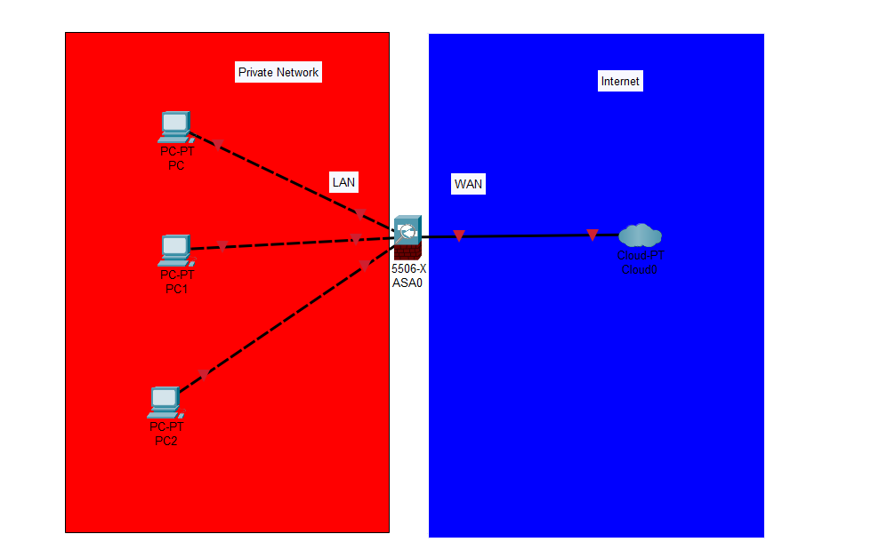

# NSA-Resarch-Cybersecurity-and-Firewalls-SonicWall-vs-pfSense
In the field of Cybersecurity, Firewall is a network security device that filters incoming and outgoing traffic based on security policies that has already been set in advance to secure the network for an organization and decides whether to accept, deny or drop traffic based on those security policies. In simpler words Firewall acts like a wall between a private internal network and a open Internet.

In this project we had the oppurtunity to compare SonicWall, a commercial firewall with pfSense a strong open-source alternative. We based our resarch on the internet and learnt about the key differneces in interfaces,configurations,security features and learning value between these two firewalls and here is the comparison.
## 📚 Comparing Learning Values: SonicWall vs. pfSense

**SonicWall** - It is a commercial firewall and is clean, easy to use interface. This firewall has good security features and is user-friendly and is good for those users those who are learning a little about networking and do not have much knowledge. This firewall is a closed-source product, users face lots of problems on learning about networking in deeper technical ways so they can get more knowledge.

**pfSense** - While, on the other hand, pfSense is and open-source firewall. This is more flexible and much easy for the users to work on it. It has a benefit that users can get complete control over the configurations. This firewall is good for those users eho want to learn in deep about the networking and know the advanced features, do the experiments, work on the real-world and also do some troubleshooting.

# Configuring pfSense vs SonicWall Firewall
Both firewalls can be configured by CLI, but if users configure pfSense via CLI, then they can get more configuration options, like they could configure it by directly changing the configuration files, whereas in SonicWall Firewall, there are very few configuration options via CLI, due to which it is used to troubleshoot only. More particularly, users can get full root access and get to use all shell commands in CLI in pfSense, whereas users can use troubleshooting commands like ping in SonicWall.

**SonicWall CLI limited to diagnosis**
**pfSense CLI have full Shell commands** 

(Reference : 
https://www.sonicwall.com/support/knowledge-base/using-top-level-cli-commands-on-the-sonicwall-via-ssh-using-putty/170505807816151
https://docs.netgate.com/pfsense/en/latest/config/console-menu.html)

# Interfaces of pfSense vs SonicWall Firewall
**Physical Interfaces** - Though the ports are labelled on pfSense Firewall, still users can change the role of these ports in the web interface or during setup( users can decide which pirt will be used for lan or wan irrespective of label on hardware). On the other hand, the ports labelled for lan or wan should be used in same way in SonicWall Firewall(exception: new sonicwall offers this override but old do not)

#  COMPARISON: SONICWALL vs. pfSENSE

| *Feature*              | *SonicWall*                                                    | *pfSense*                                               |
|--------------------------|------------------------------------------------------------------|-----------------------------------------------------------|
| *Deep Packet Inspection* | Already included, scans full data in each packet                 | Not included by default; needs tools like Snort or Suricata |
| *Intrusion Prevention* | Built-in, updates on its own to catch new threats               | Can be added with Snort or Suricata, but setup is manual  |
| *SSL/TLS Decryption*   | Can read encrypted traffic right away                            | Needs Squid and manual setup                              |
| *IP/DNS Blocking*      | Can block harmful IPs and websites out of the box               | Uses pfBlockerNG to do similar blocking                   |
| *Application Control*  | Easy to block or manage specific apps                           | Limited control; needs custom rule setup                  |
| *Firewall Tuning*      | Some settings can be changed, but it's limited                  | Full control to tweak settings, NAT, and firewall rules   |
| *Stateful Inspection*  | Tracks active connections by default                            | Same tracking feature, also built-in                      |

---

###  Sources

- 🔗 [SonicWall Firewalls](https://www.sonicwall.com/products/firewalls/)
- 🔗 [pfSense Documentation – Netgate](https://docs.netgate.com/pfsense/en/latest/)
